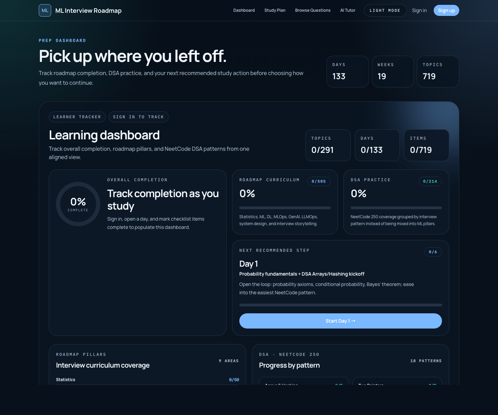
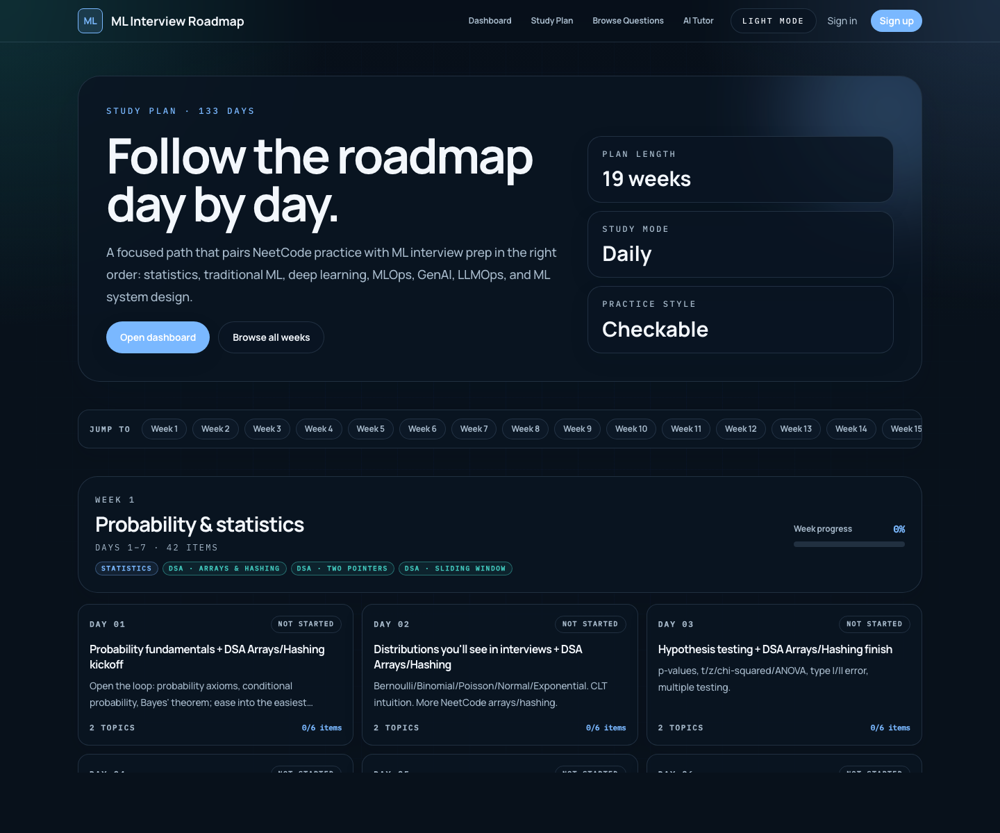
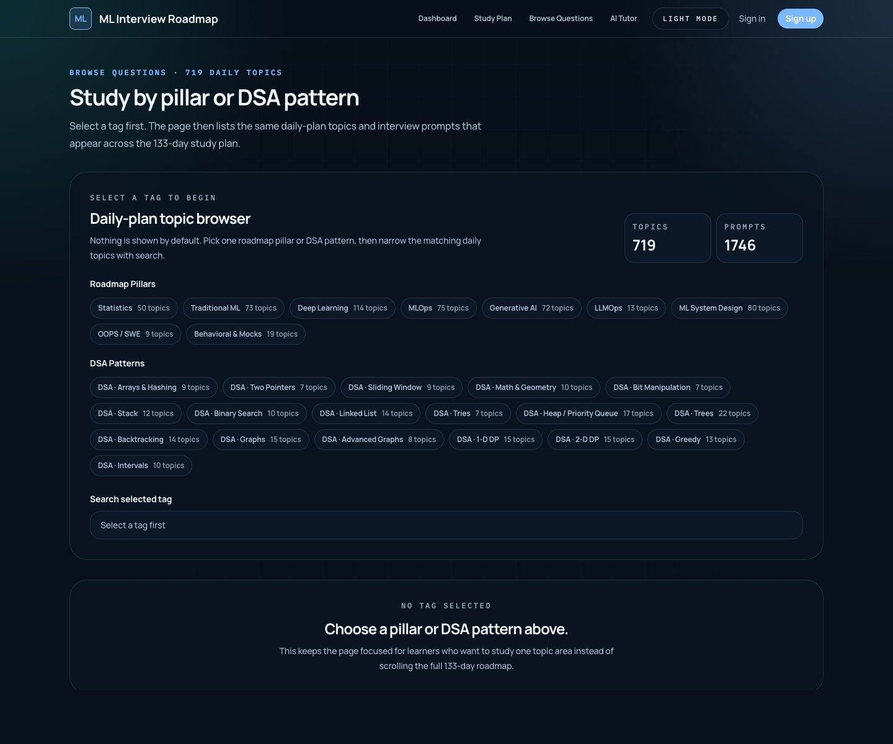
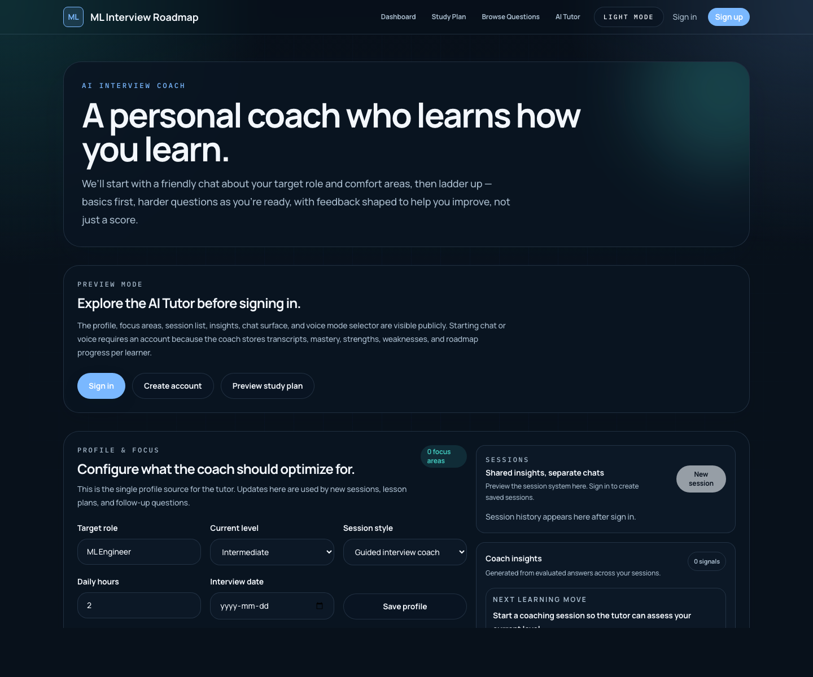

# ML Interview Roadmap

[](https://github.com/Abby263/ml-interview-roadmap/actions/workflows/ci.yml)
[](https://github.com/Abby263/ml-interview-roadmap/releases)
[](./LICENSE)

Production-grade learning platform for Machine Learning, Deep Learning,
Generative AI, LLMOps, MLOps, ML System Design, DSA, and behavioral interview
preparation.

Production: [https://ml-interview-roadmap.vercel.app](https://ml-interview-roadmap.vercel.app)

## Product Overview

ML Interview Roadmap is an interactive interview-prep operating system. It
combines a structured 133-day study plan, tag-based question browsing, progress
tracking, case studies, and an AI Tutor that can coach learners through chat or
realtime voice.

The product is designed for:

- ML candidates who need a complete roadmap from statistics to system design.
- Data Scientists moving into ML Engineering.
- Backend engineers moving into AI Engineering.
- Senior MLE, AI Engineer, GenAI Engineer, and ML Architect candidates.

Core promise:

> Prepare for ML, AI, GenAI, and ML System Design interviews with a structured
> roadmap, daily interview prompts, production case studies, and personalized AI
> coaching.

## UI Demo Walkthrough

No demo video asset exists yet, so the repo includes production screenshots and
a guided demo flow. Screenshots live in [`docs/demo`](./docs/demo).

### 1. Dashboard

The landing page is a dashboard-first experience. Learners immediately see
their progress, next action, and entry points into the study plan or question
browser.



### 2. Study Plan

The study plan exposes the full daily and weekly roadmap. Content is ordered
from statistics and traditional ML through deep learning, MLOps, GenAI, LLMOps,
system design, behavioral prep, and DSA.



### 3. Browse Questions

The question browser uses the same source content as the daily roadmap. Users
can study by topic tag instead of following the full day-by-day sequence.



### 4. AI Tutor

The AI Tutor page is visible before login so users understand the product. Chat
and voice coaching require authentication because they use profile data,
session memory, and tracker updates.



## Capabilities

- Dashboard-first learner experience with progress, next action, and clear
  entry points.
- 133-day daily roadmap with editable JSON source files.
- NeetCode 250-aligned DSA coverage grouped by interview pattern.
- Daily checklist items with interview-shaped questions, references, topics,
  and case-study links.
- Question browser backed by daily-plan content, avoiding duplicate question
  banks.
- ML and GenAI system design case-study library.
- Public AI Tutor preview.
- Signed-in AI Tutor with chat and realtime voice agents.
- Supabase-backed profile, memory, session, transcript, progress, strengths,
  and weaknesses.
- Clerk authentication with public pages available before login.
- Vercel-hosted production deployment with GitHub-based CI/CD.
- Repo-level AI development operating system for safer Codex/agent-assisted
  work.

## Curriculum Scope

The curriculum is ordered for interview readiness rather than passive reading.

1. Statistics, probability, linear algebra, optimization, and evaluation math.
2. Traditional ML, feature engineering, leakage prevention, SQL, and ML coding.
3. Deep learning, CNNs, sequence models, attention, and transformers.
4. MLOps: validation, orchestration, registry, CI/CD, deployment, monitoring,
   governance, and incident response.
5. Generative AI: LLM fundamentals, prompting, embeddings, vector search, RAG,
   fine-tuning, agents, and guardrails.
6. LLMOps: prompt/model versioning, eval regression gates, tracing, routing,
   cost controls, safety, privacy, and red teaming.
7. ML system design: requirements, metrics, feature stores, serving, monitoring,
   recommendations, search, ads, fraud, and RAG system cases.
8. Behavioral, resume, project storytelling, company-loop preparation, and DSA.

Daily content includes interview loops such as:

- `ML Coding Lab`
- `Company Loop`
- `Production ML`
- `Architect Follow-up Ladder`
- `Startup Practical Loop`

## Interview Loop Mapping

The roadmap maps to real interview loops:

- Big Tech MLE: coding, ML fundamentals, product ML system design,
  experimentation, production follow-ups, and behavioral ownership.
- AI Engineer / LLM Engineer: RAG, agents, eval harnesses, tool use,
  prompt/model release gates, LLM security, latency, and cost.
- Startup MLE: take-homes, messy notebook debugging, rapid RAG/API prototypes,
  build-vs-buy, limited data, and week-one execution plans.
- Applied Scientist: statistics, causal reasoning, modeling depth, deep
  learning fundamentals, and research-style trade-off discussion.
- Senior / Architect: capacity planning, migration strategy, multi-tenant
  isolation, incident response, governance, cost controls, and launch risk.

## AI Tutor Architecture

The AI Tutor is implemented as a deepagents-style interview coach. It combines
profile-aware prompts, tool use, memory, lesson planning, and tracker updates.

Core modules:

- [`lib/ai-tutor-prompts.ts`](./lib/ai-tutor-prompts.ts): shared persona,
  phase guidance, rubric, scaffolding, and tool policy.
- [`lib/ai-tutor-agent.ts`](./lib/ai-tutor-agent.ts): chat agent loop using
  OpenAI Responses API tools.
- [`lib/ai-tutor-realtime.ts`](./lib/ai-tutor-realtime.ts): realtime voice
  agent tools and session config.
- [`lib/ai-tutor-context.ts`](./lib/ai-tutor-context.ts): roadmap and question
  retrieval context used by both chat and voice.
- [`lib/ai-tutor-store.ts`](./lib/ai-tutor-store.ts): Supabase-backed profile,
  memory, transcript, session, and lesson-plan persistence.
- [`components/AiTutorClient.tsx`](./components/AiTutorClient.tsx): shared coach
  cockpit, profile, chat/voice selector, sessions, and insights UI.
- [`components/AiTutorVoicePanel.tsx`](./components/AiTutorVoicePanel.tsx):
  browser WebRTC client for realtime voice.

Agent behavior:

- Chat and voice use the same roadmap, questions, progress, memory, lesson plan,
  and `record_practice` semantics.
- The coach chooses the next best question from profile, focus areas, mastery,
  and roadmap context.
- Progress is checked only when a roadmap-grounded answer is marked
  `interview_ready`.
- Weak answers update memory and coaching insights, but do not check off the
  study tracker.
- Strength and weakness topics evolve as mastery scores change over time.

## System Architecture

```text
Browser
  |
  |-- Public pages: dashboard, study plan, questions, case studies
  |-- Auth-gated actions: save progress, AI Tutor chat, AI Tutor voice
  |
Next.js App Router
  |
  |-- Server Components for content-heavy pages
  |-- Server Actions for progress updates
  |-- Route Handlers for AI Tutor APIs
  |
Content Layer
  |
  |-- content/daily-plan/days/day-###.json
  |-- content/daily-plan/weeks.json
  |-- content/case-studies/*.mdx
  |
Services
  |
  |-- Clerk: authentication
  |-- Supabase: progress sync, profile, memory, sessions, transcripts
  |-- OpenAI: chat and realtime voice tutoring
  |-- Vercel: hosting, previews, production deploys
```

## Tech Stack

- Next.js App Router
- React
- TypeScript
- Tailwind CSS
- Clerk for authentication
- Supabase for progress sync and AI Tutor memory
- OpenAI Responses API and Realtime API for AI Tutor chat/voice
- MDX via `next-mdx-remote`
- Vercel for hosting
- GitHub Actions for CI and release workflows

## Repository Structure

```text
app/         Next.js routes, server actions, API route handlers, metadata
components/  Shared UI, dashboard, roadmap, question, and AI Tutor components
content/     Editable daily plan JSON, week labels, and MDX case studies
docs/demo/   Production UI screenshots used in this README
lib/         Loaders, schemas, AI Tutor agents, Supabase, auth, progress store
scripts/     Curriculum generation and content maintenance scripts
.github/     CI, release, dependabot, issue templates, PR template, CODEOWNERS
.claude/     Shared AI workflow hooks, rules, agents, and commands
prod.yml     Project architecture, hard rules, decisions, and release policy
proxy.ts     Optional Clerk proxy when auth is configured
```

Primary routes:

- `/`: dashboard and progress tracker.
- `/study-plan`: daily and weekly roadmap.
- `/questions`: tag-based question browser backed by daily-plan content.
- `/ai-tutor`: public preview plus signed-in chat/voice AI Tutor.
- `/day/[day]`: daily checklist and interview questions.
- `/case-studies`: ML and GenAI system design cases.

## Content Model

Daily plan files are the source of truth:

```text
content/daily-plan/days/day-001.json
content/daily-plan/days/day-002.json
...
content/daily-plan/days/day-133.json
```

Daily files mirror the UI:

- `day`
- `title`
- `pillar`
- `focus`
- `tracks`
- `tracks[].items[]`
- `tracks[].items[].interviewQuestions`
- `references`
- optional topic and case-study links

Question browser entries are derived from daily-plan content. Do not create a
separate duplicate question bank.

For ML-focused days, keep item-level interview questions in the 2-5 question
range when present. Questions should be phrased like real interview prompts,
not topic labels.

See [`content/daily-plan/README.md`](./content/daily-plan/README.md) for the
schema and editing guidance.

## Local Development

Install dependencies:

```bash
npm install
```

Run the development server:

```bash
npm run dev
```

Open [http://127.0.0.1:3000](http://127.0.0.1:3000).

The public roadmap, question browser, case studies, and local progress work
without external services. Signed-in sync and AI Tutor usage require optional
environment variables.

## Environment Variables

Use [`.env.example`](./.env.example) as the starting point.

Clerk:

```bash
NEXT_PUBLIC_CLERK_PUBLISHABLE_KEY=pk_test_xxx
CLERK_SECRET_KEY=sk_test_xxx
```

Supabase:

```bash
NEXT_PUBLIC_SUPABASE_URL=https://xxxxx.supabase.co
NEXT_PUBLIC_SUPABASE_PUBLISHABLE_KEY=sb_publishable_xxx
SUPABASE_SECRET_KEY=sb_secret_xxx
```

AI Tutor:

```bash
OPENAI_API_KEY=sk-xxx
AI_TUTOR_MODEL=gpt-4.1-mini
AI_TUTOR_REALTIME_MODEL=gpt-realtime-mini
AI_TUTOR_DAILY_LIMIT=80
AI_TUTOR_ENABLED=true
```

Optional tracing:

```bash
LANGSMITH_API_KEY=lsv2_xxx
LANGSMITH_TRACING=true
LANGSMITH_PROJECT=ml-interview-roadmap
```

See [`SETUP.md`](./SETUP.md) for Clerk, Google sign-in, Supabase schema, AI
Tutor memory tables, realtime voice setup, and troubleshooting.

## Quality Gates

Run before opening or merging non-trivial PRs:

```bash
npm run lint
npm run build
```

Recommended smoke checks:

```bash
curl -sS -o /dev/null -w "%{http_code}" http://127.0.0.1:3000/
curl -sS -o /dev/null -w "%{http_code}" http://127.0.0.1:3000/study-plan
curl -sS -o /dev/null -w "%{http_code}" http://127.0.0.1:3000/questions
curl -sS -o /dev/null -w "%{http_code}" http://127.0.0.1:3000/ai-tutor
```

Production smoke checks:

```bash
curl -sS -o /dev/null -w "%{http_code}" https://ml-interview-roadmap.vercel.app/
curl -sS -o /dev/null -w "%{http_code}" https://ml-interview-roadmap.vercel.app/ai-tutor
```

## Deployment

Production is hosted on Vercel:

- [https://ml-interview-roadmap.vercel.app](https://ml-interview-roadmap.vercel.app)

The primary deployment path is the Vercel GitHub App connected to `main`.
Pull requests get preview deployments. Merges to `main` deploy production.

`.github/workflows/vercel.yml` also supports optional Vercel CLI deployments
when these secrets are configured:

```bash
VERCEL_TOKEN
VERCEL_ORG_ID
VERCEL_PROJECT_ID
```

Manual production deploy:

```bash
npx vercel deploy --prod --yes
```

Production deploys should be run only from `main`.

## Operations Runbook

### Normal Release

1. Create a branch from `main`.
2. Make focused changes.
3. Run `npm run lint` and `npm run build`.
4. Open a PR with screenshots for UI changes.
5. Wait for GitHub CI and Vercel preview.
6. Merge after checks pass.
7. Verify production Vercel deployment is `READY`.
8. Smoke-test `/` and `/ai-tutor`.

### Rollback

Use one of these depending on impact:

- Revert the merge commit on `main`.
- Promote the last known-good Vercel deployment.
- Disable AI Tutor with `AI_TUTOR_ENABLED=false` if the issue is isolated to
  model-backed coaching.

### Dependency Updates

- Merge safe patch/minor updates one at a time after green checks.
- Refresh stale Dependabot branches before merging.
- Treat major compiler/runtime/tooling changes as separate PRs.
- Do not merge failing Tailwind or ESLint major bumps without migration work.

## Security Model

- Public content is accessible without login.
- Saved progress, AI Tutor chat, AI Tutor voice, memory, sessions, and tracker
  writes require authentication.
- Server-side routes verify auth before user-scoped writes.
- Supabase server-only keys must never be exposed to client code.
- `.env`, `.env.local`, `.env.preview.local`, and production secrets must not be
  committed.
- AI Tutor memory is user-scoped and should not leak across users.

Report vulnerabilities privately using [`SECURITY.md`](./SECURITY.md).

## AI Development Operating System

The repo includes a modular AI-assisted development workflow for safer
Codex/agent-assisted work:

- [`prod.yml`](./prod.yml): project brain with architecture, decisions, hard
  rules, quality gates, and release policy.
- [`.claude/settings.json`](./.claude/settings.json): shared project wiring for
  hooks, rules, agents, and slash-command workflows.
- [`.claude/hooks/`](./.claude/hooks): safety hooks that block obvious
  destructive or secret-leaking commands before they run in compatible runtimes.
- [`.claude/rules/`](./.claude/rules): context-friendly rules loaded only when
  relevant, such as frontend, database, AI Tutor, security, content, release,
  and future billing.
- [`.claude/agents/`](./.claude/agents): specialist reviewer briefs for bug,
  security, performance, and frontend design reviews.
- [`.claude/commands/`](./.claude/commands): repeatable workflows including
  `/ship`, `/review-all-agents`, `/dependency-triage`, `/content-update`, and a
  reserved `/video-editor`.

Local-only Claude files such as `.claude/settings.local.json` and
`.claude/launch.json` stay ignored.

## Contributing

Start with [`CONTRIBUTING.md`](./CONTRIBUTING.md).

Every PR should include:

- what changed;
- why it changed;
- validation commands run;
- screenshots or notes for UI changes;
- known limitations or follow-up work.

## Repository Governance

- [`CONTRIBUTING.md`](./CONTRIBUTING.md): contribution workflow and content
  rules.
- [`CODE_OF_CONDUCT.md`](./CODE_OF_CONDUCT.md): collaboration standards.
- [`SECURITY.md`](./SECURITY.md): private vulnerability reporting.
- [`SUPPORT.md`](./SUPPORT.md): support channels.
- [`CHANGELOG.md`](./CHANGELOG.md): release notes.
- `.github/ISSUE_TEMPLATE`: bug, feature, and content request templates.
- `.github/PULL_REQUEST_TEMPLATE.md`: PR checklist.
- `.github/CODEOWNERS`: default owner review routing.

## License

This repository uses the `ML Interview Roadmap Non-Commercial Source License v1.1`
(`LicenseRef-MLIR-NC-1.1`). It is source-available for personal, educational,
research, portfolio, and non-commercial community use only.

Commercial use is prohibited in any form unless prior written permission is
granted by the maintainers. This includes paid courses, bootcamps, SaaS
products, recruiting products, enterprise training, commercial deployments,
consulting, managed services, internal for-profit company training, resale,
bundling, lead generation, sponsorship packages, and derivative commercial
products.

This project intentionally does not use AGPL as the primary license because
AGPL permits commercial use. The non-commercial restriction is defined in
[`LICENSE`](./LICENSE).
